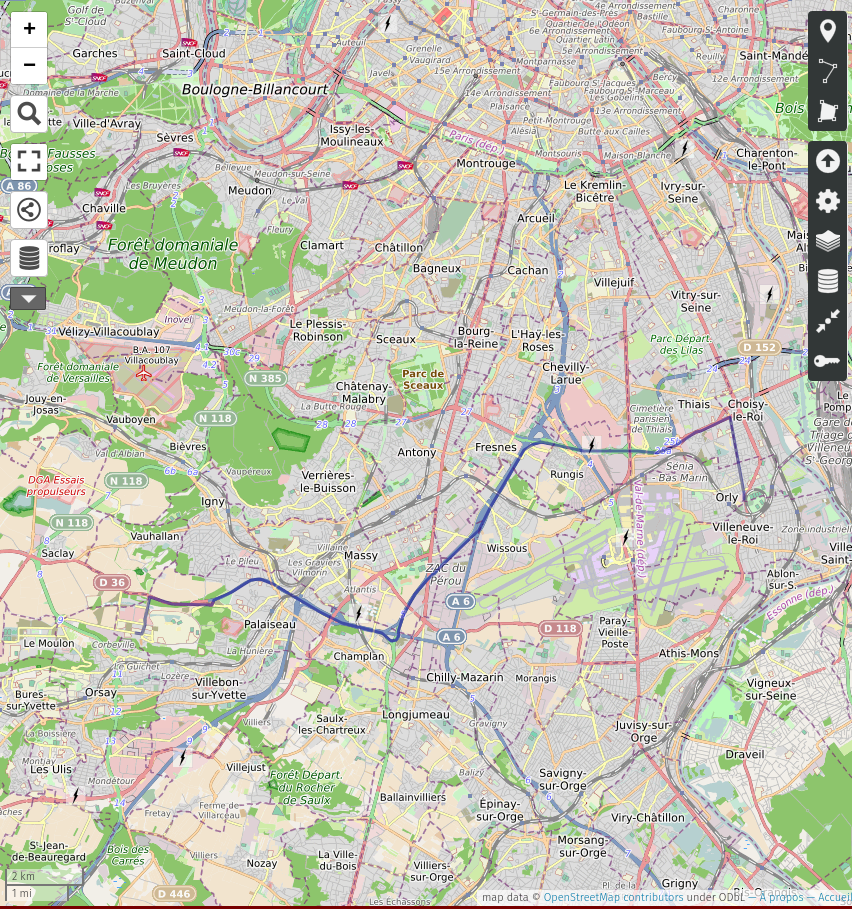

# CSC5003 Mini-projet 1
Alice ZHEN

## Objectif métier
On souhaite aider à sélectionner un point de vente de carburant à proximité d'un utilisateur automobiliste en fonction de la distance et du prix du carburant.

## Jeu de données utilisé
Prix des carburants en France le 9 janvier 2021 \
https://www.data.gouv.fr/fr/datasets/r/087dfcbc-8119-4814-8412-d0a387fac561

On peut observer que ce jeu de données est au format XML:


```scala
import scala.sys.process._
Process("cat PrixCarburants_quotidien_20210109.xml")!!
```


    import scala.sys.process._
    
    res0_1: String = """<?xml version="1.0" encoding="ISO-8859-1" standalone="yes"?>
    <pdv_liste>
      <pdv id="1000001" latitude="4620114" longitude="519791" cp="01000" pop="R">
        <adresse>596 AVENUE DE TREVOUX</adresse>
        <ville>SAINT-DENIS-L�S-BOURG</ville>
        <services>
          <service>Station de gonflage</service>
          <service>Vente de gaz domestique (Butane, Propane)</service>
          <service>DAB (Distributeur automatique de billets)</service>
        </services>
        <prix nom="Gazole" id="1" maj="2021-01-08T10:20:52" valeur="1274"/>
        <prix nom="SP95" id="2" maj="2021-01-08T10:20:52" valeur="1388"/>
        <prix nom="SP98" id="6" maj="2021-01-09T09:25:53" valeur="1405"/>
        <rupture id="4" nom="GPLc" debut="2017-09-16T09:50:23" fin=""/>
        <rupture id="3" nom="E85" debut="2017-09-16T09:50:23" fin=""/>
        <rupture id="5" nom="E10" debut="2018-12-13T09:49:49" fin=""/>
      </pdv>
      <pdv id="1000002" latitude="4621842" longitude="522767" cp="01000" pop="R">
        <adresse>16 Avenue de Marboz</adresse>
        <ville>BOURG-EN-BRESSE</ville>
        <services>
          <service>Vente de gaz domestique (Butane, Propane)</service>
          <service>DAB (Distributeur automatique de billets)</service>
        </services>
        <prix nom="Gazole" id="1" maj="2021-01-06T08:41:56" valeur="1259"/>
        <prix nom="SP95" id="2" maj="2021-01-06T08:49:43" valeur="1383"/>
        <prix nom="SP98" id="6" maj="2021-01-06T08:49:44" valeur="1405"/>
        <rupture id="3" nom="E85" debut="2017-09-07T11:05:59" fin=""/>
        <rupture id="4" nom="GPLc" debut="2017-09-07T11:05:59" fin=""/>
        <rupture id="5" nom="E10" debut="2017-09-07T11:05:59" fin=""/>
      </pdv>
      <pdv id="1000004" latitude="4618800" longitude="524500" cp="01000" pop="R">
        <adresse>20 Avenue du Mar�chal Juin</adresse>
        <ville>Bourg-en-Bresse</ville>
        <horaires automate-24-24="1">
          <jour id="1" nom="Lundi" ferme="">
            <horaire ouverture="06.30" fermeture="20.00"/>
          </jour>
          <jour id="2" nom="Mardi" ferme="">
    ...


## Préparation de l'environnement
On va utiliser Spark afin de traiter les données.

On importe dans un premier temps les dépendences nécessaires:


```scala
import $ivy.`org.apache.spark::spark-sql:2.4.0`
import $ivy.`sh.almond::almond-spark:0.10.9`
import $ivy.`com.databricks::spark-xml:0.11.0`
import $ivy.`com.lihaoyi::upickle:0.7.1`
import $ivy.`com.lihaoyi::requests:0.6.5`
```


    import $ivy.$                                  
    
    import $ivy.$                               
    
    import $ivy.$                                 
    
    import $ivy.$                           
    
    import $ivy.$                            


On configure le niveau des logs:


```scala
// Configure le niveau des logs
import org.apache.log4j.{Level, Logger}
Logger.getLogger("org").setLevel(Level.ERROR)
```


    import org.apache.log4j.{Level, Logger}
    


## Chargement des données avec Spark
On crée une session Spark:


```scala
import org.apache.spark.sql._

val spark = {
    NotebookSparkSession.builder()
        .master("local[*]")
        .getOrCreate()
}
```

    Loading spark-stubs
    Getting spark JARs
    Creating SparkSession


    Using Spark's default log4j profile: org/apache/spark/log4j-defaults.properties


<a target="_blank" href="http://192.168.1.54:4040">Spark UI</a>


    import org.apache.spark.sql._
    
    
    spark: SparkSession = org.apache.spark.sql.SparkSession@1f56ee9d


On utilise la librarie [spark-xml](https://github.com/databricks/spark-xml) afin de parser les données XML avec Spark afin de pouvoir le charger en tant que structure DataFrame:


```scala
import com.databricks.spark.xml._

// Lire le jeu de données en format XML
val df = spark.read
    .option("rowTag", "pdv")
    .option("encoding", "UTF-8")
    .xml("PrixCarburants_quotidien_20210109.xml")

df.show()
```


<script>
var comm = Jupyter.notebook.kernel.comm_manager.new_comm('cancel-stage-d41e4e6c-14f2-40d1-b8f6-d62726a69444', {});

function cancelStage(stageId) {
  console.log('Cancelling stage ' + stageId);
  comm.send({ 'stageId': stageId });
}
</script>


<div>
  <span style="float: left;">fold at InferSchema.scala:96</span>
</div>


<div class="progress">
  <div class="progress-bar" role="progressbar" style="background-color: blue; width: 100%; word-wrap: normal; white-space: nowrap; text-align: center; color: white" aria-valuenow="100" aria-valuemin="0" aria-valuemax="100">
    1 / 1
  </div>
  <div class="progress-bar" role="progressbar" style="background-color: red; width: 0%" aria-valuenow="0" aria-valuemin="0" aria-valuemax="100"></div>
</div>


<div>
  <span style="float: left;">show at cmd4.sc:9</span>
</div>


<div class="progress">
  <div class="progress-bar" role="progressbar" style="background-color: blue; width: 100%; word-wrap: normal; white-space: nowrap; text-align: center; color: white" aria-valuenow="100" aria-valuemin="0" aria-valuemax="100">
    1 / 1
  </div>
  <div class="progress-bar" role="progressbar" style="background-color: red; width: 0%" aria-valuenow="0" aria-valuemin="0" aria-valuemax="100"></div>
</div>


    +----+-------+-------------+-------------+----+--------------------+---------+--------+--------------------+--------------------+--------------------+--------------------+
    | _cp|    _id|    _latitude|   _longitude|_pop|             adresse|fermeture|horaires|                prix|             rupture|            services|               ville|
    +----+-------+-------------+-------------+----+--------------------+---------+--------+--------------------+--------------------+--------------------+--------------------+
    |1000|1000001|    4620114.0|     519791.0|   R|596 AVENUE DE TRE...|     null|    null|[[, 1, 2021-01-08...|[[, 2017-09-16T09...|[[Station de gonf...|SAINT-DENIS-L�S-B...|
    |1000|1000002|    4621842.0|     522767.0|   R| 16 Avenue de Marboz|     null|    null|[[, 1, 2021-01-06...|[[, 2017-09-07T11...|[[Vente de gaz do...|     BOURG-EN-BRESSE|
    |1000|1000004|    4618800.0|     524500.0|   R|20 Avenue du Mar�...|     null|    null|                null|                null|                null|     Bourg-en-Bresse|
    |1000|1000005|4620093.59235|519942.024022|   R|642 Avenue de Tr�...|     null|    null|                null|[[, 2011-06-01T00...|[[Carburant addit...|SAINT-DENIS-L�S-B...|
    |1000|1000006|    4620754.0|     523758.0|   R|1 Boulevard John ...|     null|    null|                null|[[, 2017-09-25T19...|[[Vente de gaz do...|     BOURG-EN-BRESSE|
    |1000|1000007|    4620105.0|     524891.0|   R|360 AVENUE DU CAP...|     null|    null|[[, 1, 2021-01-05...|                null|[[Vente de gaz do...|     Bourg-en-Bresse|
    |1000|1000008|    4619900.0|     524100.0|   R|Bd Charles de Gaulle|     null|    null|                null|                null|                null|     BOURG-EN-BRESSE|
    |1000|1000009|    4619566.0|     522935.0|   R|     56 Rue du Stand|     null|    null|                null|                null|                null|     Bourg-en-Bresse|
    |1000|1000010|4619851.83794|524350.637881|   R|Boulevard Charles...|     null|    null|                null|[[, 2011-06-09T06...|[[DAB (Distribute...|     BOURG-EN-BRESSE|
    |1000|1000012|    4620100.0|     520000.0|   R|642 AVENUE DE TRE...|     null|    null|                null|                null|                null|SAINT DENIS LES B...|
    |1000|1000013|4619851.83794|524350.637881|   R|BOULEVARD CHARLES...|     null|    null|                null|                null|                null|     Bourg-en-Bresse|
    |1090|1090001|    4609600.0|     477500.0|   R|1 ROUTE DE FRANCH...|     null|    null|[[, 1, 2021-01-04...|                null|[[DAB (Distribute...|           MONTCEAUX|
    |1100|1100001|    4628404.0|     566282.0|   R|     ROUTE DE DORTAN|     null|    null|[[, 1, 2021-01-09...|[[, 2014-08-27T00...|[[Carburant addit...|              Arbent|
    |1100|1100002|    4625000.0|     564400.0|   R| Rue Brillat-Savarin|     null|    null|                null|                null|                null|             OYONNAX|
    |1100|1100003|    4624966.0|     564134.0|   R| 174 Cours de Verdun|     null|    null|                null|[[, 2013-03-13T16...|[[Carburant addit...|             Oyonnax|
    |1100|1100004|    4627200.0|     566000.0|   R|886 AVENUE JEAN C...|     null|    null|                null|                null|                null|    ARBENT - OYONNAX|
    |1100|1100006|    4626200.0|     564800.0|   R|74 Rue Jules Mich...|     null|    null|                null|                null|                null|             Oyonnax|
    |1100|1100007|    4624966.0|     564134.0|   R| 174 COURS DE VERDUN|     null|    null|[[, 1, 2021-01-09...|                null|[[Carburant addit...|             OYONNAX|
    |1110|1110001|    4597800.0|     559900.0|   R|         Rue Masonod|     null|    null|[[, 1, 2021-01-08...|[[, 2017-09-08T08...|[[Vente de gaz do...|  HAUTEVILLE-LOMPNES|
    |1120|1120002|4584715.18044|507404.780227|   A|      AUTOROUTE A 42|     null|    null|                null|[[, 2011-06-08T11...|[[Carburant addit...|             DAGNEUX|
    +----+-------+-------------+-------------+----+--------------------+---------+--------+--------------------+--------------------+--------------------+--------------------+
    only showing top 20 rows
    


    import com.databricks.spark.xml._
    
    // Lire le jeu de données en format XML
    
    df: DataFrame = [_cp: bigint, _id: bigint ... 10 more fields]


## Nettoyer les données chargées
Nous considérons un utilisateur dont on connait les coordonnées géographiques qui va sélectionner le type de carburant qu'il recherche.

Dans notre exemple, il s'agit d'un véhicule au **19 place Marguerite Perey
à Palaiseau** qui souhaite se recharger en **SP95**.


```scala
// Informations sur le véhicule de l'utilisateur
val inputCarburantType = "SP95"
val inputLat = "48.712793"
val inputLong = "2.199441"
```


    inputCarburantType: String = "SP95"
    inputLat: String = "48.712793"
    inputLong: String = "2.199441"


Nous allons nettoyer dans un premier temps le jeu de données en ne conservant que les points de vente où le carburant sélectionné est vendu et disponible et en ne sélectionnant que les colonnes qui nous intéressent:


```scala
import org.apache.spark.sql.functions.{array_contains, col, explode}

val dfClean = df.withColumn("prix", explode(col("prix")))
    .select("_longitude", "_latitude", "adresse", "ville", "prix._valeur")
    .filter(col("prix._nom") === inputCarburantType)
    .filter(! array_contains(col("rupture._nom"), inputCarburantType))
```


    import org.apache.spark.sql.functions.{array_contains, col, explode}
    
    
    dfClean: Dataset[Row] = [_longitude: double, _latitude: double ... 3 more fields]


L'affichage des données nettoyées nous donne le tableau ci-dessous:


```scala
dfClean.show()
```


<div>
  <span style="float: left;">show at cmd7.sc:1</span>
</div>


<div class="progress">
  <div class="progress-bar" role="progressbar" style="background-color: blue; width: 100%; word-wrap: normal; white-space: nowrap; text-align: center; color: white" aria-valuenow="100" aria-valuemin="0" aria-valuemax="100">
    1 / 1
  </div>
  <div class="progress-bar" role="progressbar" style="background-color: red; width: 0%" aria-valuenow="0" aria-valuemin="0" aria-valuemax="100"></div>
</div>


    +-------------+-------------+--------------------+--------------------+-------+
    |   _longitude|    _latitude|             adresse|               ville|_valeur|
    +-------------+-------------+--------------------+--------------------+-------+
    |     519791.0|    4620114.0|596 AVENUE DE TRE...|SAINT-DENIS-L�S-B...|   1388|
    |     522767.0|    4621842.0| 16 Avenue de Marboz|     BOURG-EN-BRESSE|   1383|
    |     524500.0|    4618800.0|20 Avenue du Mar�...|     Bourg-en-Bresse|   1490|
    |     524100.0|    4619900.0|Bd Charles de Gaulle|     BOURG-EN-BRESSE|   1388|
    |     522935.0|    4619566.0|     56 Rue du Stand|     Bourg-en-Bresse|   1383|
    |     566282.0|    4628404.0|     ROUTE DE DORTAN|              Arbent|   1429|
    |     566000.0|    4627200.0|886 AVENUE JEAN C...|    ARBENT - OYONNAX|   1439|
    |     559900.0|    4597800.0|         Rue Masonod|  HAUTEVILLE-LOMPNES|   1420|
    |     569100.0|    4616700.0| 867 ROUTE DE GENEVE|LE POIZAT LALLEYRIAT|   1459|
    |     527800.0|    4583900.0|Avenue Charles de...|        SAINT-VULBAS|   1442|
    |   534231.844|  4604020.975|Le Pont Rompu - R...|          PONT-D'AIN|   1420|
    |     537600.0|    4607400.0|Rue du Docteur Hu...|    NEUVILLE-SUR-AIN|   1379|
    |     607900.0|    4629300.0|                 RN5|               S�GNY|   1389|
    |605319.031966|4632242.54852|Lieu-Dit les Vert...|                 GEX|   1379|
    |     581200.0|    4612400.0|Avenue Mar�chal d...|Bellegarde-sur-Va...|   1359|
    |     611817.0|    4625303.0| Chemin de la Bru...|     FERNEY-VOLTAIRE|   1389|
    |     609500.0|    4624400.0|     Route de Meyrin|     FERNEY-VOLTAIRE|   1385|
    |     614100.0|    4634300.0|691 AVENUE DU CRE...|   Divonne-les-Bains|   1428|
    |     543200.0|    4594200.0|38 AVENUE DE L EU...|SAINT-RAMBERT-EN-...|   1440|
    |     539400.0|    4592100.0|             RD 1504|             Torcieu|   1460|
    +-------------+-------------+--------------------+--------------------+-------+
    only showing top 20 rows
    


## Enrichir les données en calculant la distance des points de vente
Afin de pouvoir ordonner les points de vente en fonction de leur distance à l'utilisateur, nous allons ajouter une colonne dans le jeu de données qui va contenir la distance du point de vente à l'utilisateur.

Pour obtenir cette distance, nous utiliserons [l'API OpenRoute Service](https://openrouteservice.org/) qui permet entre autre de déterminer un itinéraire entre deux points.


```scala
import java.nio.file.{Paths, Files}
import java.nio.charset.StandardCharsets

// Définit les variables d'ORS utilisées
val orsToken = Files.readString(Paths.get(".ors_token"), StandardCharsets.UTF_8)
val orsProfile = "driving-car"
```


Cette API est gratuite, c'est pourquoi son utilisation est limitée par des quotas (max 40 requêtes / min et 2000 requêtes / jour). Afin de respecter ces quotas, nous choisissons de limiter notre démonstration à un échantillon de 200 points de ventes et nous attendons 1.5s entre chaque requête. Nous allons également mettre en cache les données résultant de ces requêtes afin de ne pas avoir à les refaire par la suite.


```scala
import java.lang.String
import java.time._
import org.apache.spark.sql.functions.udf
import org.apache.spark.sql.types._
import ujson._


// Définit une fonction qui interroge l'API Openroute Service et qui renvoie la distance en km
def getDistanceFromUser(long:Double, lat:Double) : String = {
    var url = "https://api.openrouteservice.org/v2/directions/driving-car/geojson"
    var data = Obj("coordinates" -> Arr(Arr(inputLong,inputLat), Arr(long,lat)), 
                   "radiuses" -> Arr(350, 2000))
    var headers = Map("Authorization" -> orsToken, "Content-Type" -> "application/json; charset=utf-8")
    
    var req = requests.post(url = url, data = data.toString, headers = headers)
    
    var distance = -1.0
    if (req.statusCode == 200) {
        distance = ujson.read(req.text)("features")(0)("properties")("summary")("distance").num / 1000
    }
    // Pause pour ne pas dépasser le quota de 40 requests/min
    Thread.sleep(1500)
    return String.valueOf(distance)
}

// Définit une UDF
def getDistance = udf(getDistanceFromUser _, StringType)

// Ajoute la colonne `distance` aux données 
// (on prend un échantillon de 200 en raison des limitations de crédits API)
val dfDistance = dfClean.sample(true, 1D*200/df.count)
                .withColumn("longitude", col("_longitude") / 100000)
                .withColumn("latitude", col("_latitude") / 100000)
                .withColumn("distance", getDistance(col("longitude"), col("latitude")))
                .filter(col("distance") > 0)
                .select("adresse", "ville", "_valeur", "longitude", "latitude", "distance")
                .cache()
```


<div>
  <span style="float: left;">count at cmd9.sc:31</span>
</div>


<div class="progress">
  <div class="progress-bar" role="progressbar" style="background-color: blue; width: 100%; word-wrap: normal; white-space: nowrap; text-align: center; color: white" aria-valuenow="100" aria-valuemin="0" aria-valuemax="100">
    1 / 1
  </div>
  <div class="progress-bar" role="progressbar" style="background-color: red; width: 0%" aria-valuenow="0" aria-valuemin="0" aria-valuemax="100"></div>
</div>


<div>
  <span style="float: left;">count at cmd9.sc:31</span>
</div>


<div class="progress">
  <div class="progress-bar" role="progressbar" style="background-color: blue; width: 100%; word-wrap: normal; white-space: nowrap; text-align: center; color: white" aria-valuenow="100" aria-valuemin="0" aria-valuemax="100">
    1 / 1
  </div>
  <div class="progress-bar" role="progressbar" style="background-color: red; width: 0%" aria-valuenow="0" aria-valuemin="0" aria-valuemax="100"></div>
</div>


    import java.lang.String
    
    import java.time._
    
    import org.apache.spark.sql.functions.udf
    
    import org.apache.spark.sql.types._
    
    import ujson._
    
    
    // Définit une fonction qui interroge l'API Openroute Service et qui renvoie la distance en km
    
    defined function getDistanceFromUser
    defined function getDistance
    dfDistance: Dataset[Row] = [adresse: string, ville: string ... 4 more fields]


On peut observer qu'une colonne `distance` a bien été ajoutée à nos données:


```scala
dfDistance.show()
```


<div>
  <span style="float: left;">show at cmd10.sc:1</span>
</div>


<div class="progress">
  <div class="progress-bar" role="progressbar" style="background-color: blue; width: 100%; word-wrap: normal; white-space: nowrap; text-align: center; color: white" aria-valuenow="100" aria-valuemin="0" aria-valuemax="100">
    1 / 1
  </div>
  <div class="progress-bar" role="progressbar" style="background-color: red; width: 0%" aria-valuenow="0" aria-valuemin="0" aria-valuemax="100"></div>
</div>


    +--------------------+--------------------+-------+------------------+------------------+------------------+
    |             adresse|               ville|_valeur|         longitude|          latitude|          distance|
    +--------------------+--------------------+-------+------------------+------------------+------------------+
    |1000 rue jean jaures|    Fresnoy-le-Grand|   1371|         3.4304281|         49.957514|210.43370000000002|
    |ZAC DE W� - 2 ave...|       CARIGNAN - W�|   1384|        5.16159956|       49.63718865|            283.01|
    |   Route de Toulouse|        Saint-Lizier|   1389|   1.1307646674172|   43.002708124042|          748.4149|
    |    335 rue du p�age|               AUXON|   1414|             3.917|             48.11|          167.3117|
    |  BOULEVARD NAPOLEON|  Brienne-le-Ch�teau|   1385|          4.528256|        48.3965167|          209.9967|
    |33 Boulevard du M...|           Marseille|   1391|           5.40524|          43.31339|          764.3521|
    |chemin du puits d...|           LA CIOTAT|   1402|             5.602|            43.188| 794.6619000000001|
    | route de Ouistreham|Saint-Aubin-d'Arq...|   1369|       -0.28047954|       49.26294216|           253.621|
    |     Rue des Acacias|La Chapelle-Saint...|   1384|             2.324|            47.063|          221.6478|
    |AVENUE RAYMOND PO...|               OBJAT|   1369|             1.413|            45.259|          460.6563|
    |               RT 20|               Corte|   1550|   9.1575178955876|   42.301790177065|           1166.49|
    |RUE DU VIEUX CH�TEAU|              TOUTRY|   1412|             4.122|            47.502|          219.2476|
    |  RUE DE LA VERDOLLE|     ORCHAMPS-VENNES|   1386|             6.522|            47.129|444.98720000000003|
    |66 RUE DE SELONCOURT|          AUDINCOURT|   1369|             6.847|            47.475|          470.8559|
    |     56 AV DU MAQUIS|    Romans-sur-Is�re|   1440|             5.075|            45.049|          556.6525|
    |      ROUTE DE LYONS|            IGOVILLE|   1419|             1.157|            49.319|           129.663|
    |228 Avenue de Cas...|            Toulouse|   1551|1.4889210000000002|43.594424000000004|          656.6825|
    |450 Avenue du G�n...|            Cadaujac|   1379|          -0.53211|          44.75214| 568.2818000000001|
    |  2 rue des Bouquets|             COUTRAS|   1369|   -0.122292144133|     45.0483566606| 513.8892999999999|
    | 10 Route de Lalande|           Montussan|   1449|             -0.43|            44.874|          559.7402|
    +--------------------+--------------------+-------+------------------+------------------+------------------+
    only showing top 20 rows
    


## Proposer des résultats en fonction des critères sélectionnés
Une fois la distance à l'utilisateur des points de vente de notre échantillon ajoutée à nos données, nous allons pouvoir proposer des résultats.

Pour cela, nous proposerons à l'utilisateur de sélectionner la **distance maximum** de la recherche (300 km dans notre exemple car nous avons pris seulement un échantillon des données).

Il doit ensuite choisir entre deux critères: la **distance** et le **prix**.

Le choix du critère `distance` va proposer à l'utilisateur les points de vente dans l'ordre de proximité par rapport à sa localisation.

Le choix du critère `price` quant à lui va ordonner les points de vente par ordre de prix croissant.


```scala
import org.apache.spark.sql.functions.asc
import scala.math.round

val round_ = udf((value: String) => "%.2f".format(value.toDouble))

// Définit une fonction pour prendre les meilleurs résultats selon nos critères
def getBestResults(order: String, maxDistance: Double, dataframe: Dataset[Row]) = {
    order match {
        case "distance" => dataframe.withColumn("distance", round_(col("distance")).cast(DoubleType))
                            .withColumn("prix", col("_valeur").cast(DoubleType) / 1000)
                            .filter(col("distance") < maxDistance)
                            .orderBy(col("distance").asc)
        case "price" => dataframe.withColumn("distance", round_(col("distance")).cast(DoubleType))
                        .filter(col("distance") < maxDistance)
                        .withColumn("prix", col("_valeur").cast(DoubleType) / 1000)
                        .orderBy(col("prix").asc)
        case _ => spark.emptyDataFrame
    }
}

// Sélectionne les critères selon lesquels on choisit de classer les points de vente
var maxDistance = 300

var order = "distance"
val bestResultsByDistance = getBestResults(order, maxDistance, dfDistance).select("longitude", "latitude", "adresse", "ville", "prix", "distance")

order = "price"
val bestResultsByPrice = getBestResults(order, maxDistance, dfDistance).select("longitude", "latitude", "adresse", "ville", "prix", "distance")
```


<div class="jp-RenderedText">
<pre><code><span style="color: rgb(0, 187, 0)"><span class="ansi-green-fg">import </span></span><span style="color: rgb(0, 187, 187)"><span class="ansi-cyan-fg">org.apache.spark.sql.functions.asc
</span></span>
<span style="color: rgb(0, 187, 0)"><span class="ansi-green-fg">import </span></span><span style="color: rgb(0, 187, 187)"><span class="ansi-cyan-fg">scala.math.round

</span></span>
<span style="color: rgb(0, 187, 187)"><span class="ansi-cyan-fg">round_</span></span>: <span style="color: rgb(0, 187, 0)"><span class="ansi-green-fg">expressions</span></span>.<span style="color: rgb(0, 187, 0)"><span class="ansi-green-fg">UserDefinedFunction</span></span> = <span style="color: yellow"><span class="ansi-yellow-fg">UserDefinedFunction</span></span>(
  ammonite.$sess.cmd11$Helper$$Lambda$5517/0x0000000801b10840@730562a3,
  StringType,
  <span style="color: yellow"><span class="ansi-yellow-fg">Some</span></span>(<span style="color: yellow"><span class="ansi-yellow-fg">List</span></span>(StringType))
)
defined <span style="color: rgb(0, 187, 0)"><span class="ansi-green-fg">function</span></span> <span style="color: rgb(0, 187, 187)"><span class="ansi-cyan-fg">getBestResults</span></span>
<span style="color: rgb(0, 187, 187)"><span class="ansi-cyan-fg">maxDistance</span></span>: <span style="color: rgb(0, 187, 0)"><span class="ansi-green-fg">Int</span></span> = <span style="color: rgb(0, 187, 0)"><span class="ansi-green-fg">300</span></span>
<span style="color: rgb(0, 187, 187)"><span class="ansi-cyan-fg">order</span></span>: <span style="color: rgb(0, 187, 0)"><span class="ansi-green-fg">String</span></span> = <span style="color: rgb(0, 187, 0)"><span class="ansi-green-fg">&quot;price&quot;</span></span>
<span style="color: rgb(0, 187, 187)"><span class="ansi-cyan-fg">bestResultsByDistance</span></span>: <span style="color: rgb(0, 187, 0)"><span class="ansi-green-fg">DataFrame</span></span> = [longitude: double, latitude: double ... 4 more fields]
<span style="color: rgb(0, 187, 187)"><span class="ansi-cyan-fg">bestResultsByPrice</span></span>: <span style="color: rgb(0, 187, 0)"><span class="ansi-green-fg">DataFrame</span></span> = [longitude: double, latitude: double ... 4 more fields]</code></pre>
</div>


## Affichage des points de vente sélectionnés
Une fois les données ordonnées, nous pouvons afficher le choix des points de vente qui correspondent aux critères:


```scala
// Affiche les meilleurs résultats selon le critère distance
bestResultsByDistance.show()
```


<div>
  <span style="float: left;">show at cmd12.sc:1</span>
</div>


<div class="progress">
  <div class="progress-bar" role="progressbar" style="background-color: blue; width: 100%; word-wrap: normal; white-space: nowrap; text-align: center; color: white" aria-valuenow="100" aria-valuemin="0" aria-valuemax="100">
    1 / 1
  </div>
  <div class="progress-bar" role="progressbar" style="background-color: red; width: 0%" aria-valuenow="0" aria-valuemin="0" aria-valuemax="100"></div>
</div>


    +---------------+------------------+--------------------+--------------------+-----+--------+
    |      longitude|          latitude|             adresse|               ville| prix|distance|
    +---------------+------------------+--------------------+--------------------+-----+--------+
    |          2.408|            48.743|8 Place Gaston Viens|                Orly|1.419|   21.41|
    |          2.393|            48.296|35 rue du general...|         MALESHERBES|1.359|   75.05|
    |          2.373|            49.137|  ROUTE DE ROYAUMONT|             VIARMES|1.377|   80.62|
    |          2.798|            49.298|176, Avenue de la...|B�THISY-SAINT-PIERRE|1.395|  102.78|
    |          1.157|            49.319|      ROUTE DE LYONS|            IGOVILLE|1.419|  129.66|
    |          1.034|            49.451|     rue de Montigny|            CANTELEU|1.369|  148.47|
    |1.2993805014435|    47.58142578404|1 rue de la Quini�re|               Blois|1.375|   164.2|
    |1.2993805014435|    47.58142578404|1 rue de la Quini�re|               Blois|1.375|   164.2|
    |          3.917|             48.11|    335 rue du p�age|               AUXON|1.414|  167.31|
    |          1.942|            50.129|      5 rue du hamel|       SAINT-RIQUIER|1.379|  205.69|
    |          0.101|            49.506|8, rue Romain Rol...|            Le Havre|1.375|  208.68|
    |       4.528256|        48.3965167|  BOULEVARD NAPOLEON|  Brienne-le-Ch�teau|1.385|   210.0|
    |      3.4304281|         49.957514|1000 rue jean jaures|    Fresnoy-le-Grand|1.371|  210.43|
    |          4.122|            47.502|RUE DU VIEUX CH�TEAU|              TOUTRY|1.412|  219.25|
    |          2.324|            47.063|     Rue des Acacias|La Chapelle-Saint...|1.384|  221.65|
    |           3.41|            50.112|      Rue de la Gare|              CAUDRY|1.363|  222.36|
    |  3.53760957315|50.094479150400005|37 av Mal de Latt...|           LE CATEAU|1.388|  230.83|
    |    -0.28047954|       49.26294216| route de Ouistreham|Saint-Aubin-d'Arq...|1.369|  253.62|
    |     5.16159956|       49.63718865|ZAC DE W� - 2 ave...|       CARIGNAN - W�|1.384|  283.01|
    +---------------+------------------+--------------------+--------------------+-----+--------+
    


```scala
// Affiche les meilleurs résultats selon le critère prix
bestResultsByPrice.show()
```


<div>
  <span style="float: left;">show at cmd13.sc:1</span>
</div>


<div class="progress">
  <div class="progress-bar" role="progressbar" style="background-color: blue; width: 100%; word-wrap: normal; white-space: nowrap; text-align: center; color: white" aria-valuenow="100" aria-valuemin="0" aria-valuemax="100">
    1 / 1
  </div>
  <div class="progress-bar" role="progressbar" style="background-color: red; width: 0%" aria-valuenow="0" aria-valuemin="0" aria-valuemax="100"></div>
</div>


    +---------------+------------------+--------------------+--------------------+-----+--------+
    |      longitude|          latitude|             adresse|               ville| prix|distance|
    +---------------+------------------+--------------------+--------------------+-----+--------+
    |          2.393|            48.296|35 rue du general...|         MALESHERBES|1.359|   75.05|
    |           3.41|            50.112|      Rue de la Gare|              CAUDRY|1.363|  222.36|
    |          1.034|            49.451|     rue de Montigny|            CANTELEU|1.369|  148.47|
    |    -0.28047954|       49.26294216| route de Ouistreham|Saint-Aubin-d'Arq...|1.369|  253.62|
    |      3.4304281|         49.957514|1000 rue jean jaures|    Fresnoy-le-Grand|1.371|  210.43|
    |1.2993805014435|    47.58142578404|1 rue de la Quini�re|               Blois|1.375|   164.2|
    |1.2993805014435|    47.58142578404|1 rue de la Quini�re|               Blois|1.375|   164.2|
    |          0.101|            49.506|8, rue Romain Rol...|            Le Havre|1.375|  208.68|
    |          2.373|            49.137|  ROUTE DE ROYAUMONT|             VIARMES|1.377|   80.62|
    |          1.942|            50.129|      5 rue du hamel|       SAINT-RIQUIER|1.379|  205.69|
    |          2.324|            47.063|     Rue des Acacias|La Chapelle-Saint...|1.384|  221.65|
    |     5.16159956|       49.63718865|ZAC DE W� - 2 ave...|       CARIGNAN - W�|1.384|  283.01|
    |       4.528256|        48.3965167|  BOULEVARD NAPOLEON|  Brienne-le-Ch�teau|1.385|   210.0|
    |  3.53760957315|50.094479150400005|37 av Mal de Latt...|           LE CATEAU|1.388|  230.83|
    |          2.798|            49.298|176, Avenue de la...|B�THISY-SAINT-PIERRE|1.395|  102.78|
    |          4.122|            47.502|RUE DU VIEUX CH�TEAU|              TOUTRY|1.412|  219.25|
    |          3.917|             48.11|    335 rue du p�age|               AUXON|1.414|  167.31|
    |          1.157|            49.319|      ROUTE DE LYONS|            IGOVILLE|1.419|  129.66|
    |          2.408|            48.743|8 Place Gaston Viens|                Orly|1.419|   21.41|
    +---------------+------------------+--------------------+--------------------+-----+--------+
    


On peut observer que les stations suggérées dans notre exemple sont très éloignées de l'utilisateur. Cela s'explique par l'échantillon restreint de points de vente sur lequel nous avons travaillé. 

Travailler sur le jeu de données en entier aurait permis que seuls les points de vente les plus proches soient suggérés à l'utilisateur.

## Visualisation
Supposons que l'utilisateur souhaite se rendre dans le point de vente le plus proche (8 Place Gaston Viens à Orly).

La réponse de l'API OpenRoute Service nous permet également d'obtenir un itinéraire pour aller de l'utilisateur au point de vente.

Pour cela, on peut sélectionner les coordonnées du point de vente le plus proche trouvé et effectuer une nouvelle requête à l'API ORS afin de récupérer l'itinéraire sous format GeoJSON:


```scala
// On récupère les coordonnées du point de vente le plus proche:
val destLong = bestResultsByDistance.select(col("longitude")).first().getDouble(0)
val destLat = bestResultsByDistance.select(col("latitude")).first().getDouble(0)
                    
// On construit la requête
var url = "https://api.openrouteservice.org/v2/directions/driving-car/geojson"
var data = Obj("coordinates" -> Arr(Arr(inputLong,inputLat), Arr(destLong,destLat)), 
                   "radiuses" -> Arr(350, 2000))
var headers = Map("Authorization" -> s"$orsToken", "Content-Type" -> "application/json; charset=utf-8")
    
// On effectue la requête
var req = requests.post(url = url, data = data.toString, headers = headers)
assert(req.statusCode == 200)

Files.write(Paths.get("pathGeo.json"), ujson.transform(req.text, BytesRenderer()).toBytes)
```


<div>
  <span style="float: left;">first at cmd14.sc:1</span>
</div>


<div class="progress">
  <div class="progress-bar" role="progressbar" style="background-color: blue; width: 100%; word-wrap: normal; white-space: nowrap; text-align: center; color: white" aria-valuenow="100" aria-valuemin="0" aria-valuemax="100">
    1 / 1
  </div>
  <div class="progress-bar" role="progressbar" style="background-color: red; width: 0%" aria-valuenow="0" aria-valuemin="0" aria-valuemax="100"></div>
</div>


<div>
  <span style="float: left;">first at cmd14.sc:2</span>
</div>


<div class="progress">
  <div class="progress-bar" role="progressbar" style="background-color: blue; width: 100%; word-wrap: normal; white-space: nowrap; text-align: center; color: white" aria-valuenow="100" aria-valuemin="0" aria-valuemax="100">
    1 / 1
  </div>
  <div class="progress-bar" role="progressbar" style="background-color: red; width: 0%" aria-valuenow="0" aria-valuemin="0" aria-valuemax="100"></div>
</div>


<div class="jp-RenderedText">
<pre><code><span style="color: rgb(0, 187, 187)"><span class="ansi-cyan-fg">destLong</span></span>: <span style="color: rgb(0, 187, 0)"><span class="ansi-green-fg">Double</span></span> = <span style="color: rgb(0, 187, 0)"><span class="ansi-green-fg">2.408</span></span>
<span style="color: rgb(0, 187, 187)"><span class="ansi-cyan-fg">destLat</span></span>: <span style="color: rgb(0, 187, 0)"><span class="ansi-green-fg">Double</span></span> = <span style="color: rgb(0, 187, 0)"><span class="ansi-green-fg">48.743</span></span>
<span style="color: rgb(0, 187, 187)"><span class="ansi-cyan-fg">url</span></span>: <span style="color: rgb(0, 187, 0)"><span class="ansi-green-fg">String</span></span> = <span style="color: rgb(0, 187, 0)"><span class="ansi-green-fg">&quot;https://api.openrouteservice.org/v2/directions/driving-car/geojson&quot;</span></span>
<span style="color: rgb(0, 187, 187)"><span class="ansi-cyan-fg">data</span></span>: <span style="color: rgb(0, 187, 0)"><span class="ansi-green-fg">Obj</span></span> = <span style="color: yellow"><span class="ansi-yellow-fg">Obj</span></span>(
  <span style="color: yellow"><span class="ansi-yellow-fg">Map</span></span>(
    <span style="color: rgb(0, 187, 0)"><span class="ansi-green-fg">&quot;coordinates&quot;</span></span> -&gt; <span style="color: yellow"><span class="ansi-yellow-fg">Arr</span></span>(
      <span style="color: yellow"><span class="ansi-yellow-fg">ArrayBuffer</span></span>(
        <span style="color: yellow"><span class="ansi-yellow-fg">Arr</span></span>(<span style="color: yellow"><span class="ansi-yellow-fg">ArrayBuffer</span></span>(<span style="color: yellow"><span class="ansi-yellow-fg">Str</span></span>(<span style="color: rgb(0, 187, 0)"><span class="ansi-green-fg">&quot;2.199441&quot;</span></span>), <span style="color: yellow"><span class="ansi-yellow-fg">Str</span></span>(<span style="color: rgb(0, 187, 0)"><span class="ansi-green-fg">&quot;48.712793&quot;</span></span>))),
        <span style="color: yellow"><span class="ansi-yellow-fg">Arr</span></span>(<span style="color: yellow"><span class="ansi-yellow-fg">ArrayBuffer</span></span>(<span style="color: yellow"><span class="ansi-yellow-fg">Num</span></span>(<span style="color: rgb(0, 187, 0)"><span class="ansi-green-fg">2.408</span></span>), <span style="color: yellow"><span class="ansi-yellow-fg">Num</span></span>(<span style="color: rgb(0, 187, 0)"><span class="ansi-green-fg">48.743</span></span>)))
      )
    ),
    <span style="color: rgb(0, 187, 0)"><span class="ansi-green-fg">&quot;radiuses&quot;</span></span> -&gt; <span style="color: yellow"><span class="ansi-yellow-fg">Arr</span></span>(<span style="color: yellow"><span class="ansi-yellow-fg">ArrayBuffer</span></span>(<span style="color: yellow"><span class="ansi-yellow-fg">Num</span></span>(<span style="color: rgb(0, 187, 0)"><span class="ansi-green-fg">350.0</span></span>), <span style="color: yellow"><span class="ansi-yellow-fg">Num</span></span>(<span style="color: rgb(0, 187, 0)"><span class="ansi-green-fg">2000.0</span></span>)))
  )
)
<span style="color: rgb(0, 187, 187)"><span class="ansi-cyan-fg">headers</span></span>: <span style="color: rgb(0, 187, 0)"><span class="ansi-green-fg">Map</span></span>[<span style="color: rgb(0, 187, 0)"><span class="ansi-green-fg">String</span></span>, <span style="color: rgb(0, 187, 0)"><span class="ansi-green-fg">String</span></span>] = <span style="color: yellow"><span class="ansi-yellow-fg">Map</span></span>(
  <span style="color: rgb(0, 187, 0)"><span class="ansi-green-fg">&quot;Authorization&quot;</span></span> -&gt; <span style="color: rgb(0, 187, 0)"><span class="ansi-green-fg">&quot;5b3ce3597851110001cf6248362c82d2031e4ef6afd32a13f0cf5f02&quot;</span></span>,
  <span style="color: rgb(0, 187, 0)"><span class="ansi-green-fg">&quot;Content-Type&quot;</span></span> -&gt; <span style="color: rgb(0, 187, 0)"><span class="ansi-green-fg">&quot;application/json; charset=utf-8&quot;</span></span>
)
<span style="color: rgb(0, 187, 187)"><span class="ansi-cyan-fg">req</span></span>: <span style="color: rgb(0, 187, 0)"><span class="ansi-green-fg">requests</span></span>.<span style="color: rgb(0, 187, 0)"><span class="ansi-green-fg">Response</span></span> = <span style="color: yellow"><span class="ansi-yellow-fg">Response</span></span>(
  <span style="color: rgb(0, 187, 0)"><span class="ansi-green-fg">&quot;https://api.openrouteservice.org/v2/directions/driving-car/geojson&quot;</span></span>,
  <span style="color: rgb(0, 187, 0)"><span class="ansi-green-fg">200</span></span>,
  <span style="color: rgb(0, 187, 0)"><span class="ansi-green-fg">&quot;OK&quot;</span></span>,
  {&quot;type&quot;:&quot;FeatureCollection&quot;,&quot;features&quot;:[{&quot;bbox&quot;:[2.199355,48.710657,2.408218,48.761324],&quot;type&quot;:&quot;Feature&quot;,&quot;properties&quot;:{&quot;segments&quot;:[{&quot;distance&quot;:21414.2,&quot;duration&quot;:1378.4,&quot;steps&quot;:[{&quot;distance&quot;:175.8,&quot;duration&quot;:31.1,&quot;type&quot;:11,&quot;instruction&quot;:&quot;Head east on Boulevard Thomas Gobert, D 128&quot;,&quot;name&quot;:&quot;Boulevard Thomas Gobert, D 128&quot;,&quot;way_points&quot;:[0,3]},{&quot;distance&quot;:964.7,&quot;duration&quot;:81.8,&quot;type&quot;:0,&quot;instruction&quot;:&quot;Turn left onto Avenue de la Vauve, D 128&quot;,&quot;name&quot;:&quot;Avenue de la Vauve, D 128&quot;,&quot;way_points&quot;:[3,21]},{&quot;distance&quot;:1544.4,&quot;duration&quot;:126.7,&quot;type&quot;:7,&quot;instruction&quot;:&quot;Enter the roundabout and take the 1st exit onto Route de Saclay, D 36&quot;,&quot;name&quot;:&quot;Route de Saclay, D 36&quot;,&quot;exit_number&quot;:1,&quot;way_points&quot;:[21,56]},{&quot;distance&quot;:133.6,&quot;duration&quot;:19.8,&quot;type&quot;:12,&quot;instruction&quot;:&quot;Keep left onto Route de Saclay, D 36G&quot;,&quot;name&quot;:&quot;Route de Saclay, D 36G&quot;,&quot;way_points&quot;:[56,64]},{&quot;distance&quot;:4673.8,&quot;duration&quot;:280.5,&quot;type&quot;:13,&quot;instruction&quot;:&quot;Keep right onto A 126&quot;,&quot;name&quot;:&quot;A 126&quot;,&quot;way_points&quot;:[64,120]},{&quot;distance&quot;:225.7,&quot;duration&quot;:18.1,&quot;type&quot;:6,&quot;instruction&quot;:&quot;Continue straight onto L'Aquitaine, A 10&quot;,&quot;name&quot;:&quot;L'Aquitaine, A 10&quot;,&quot;way_points&quot;:[120,126]},{&quot;distance&quot;:3439.6,&quot;duration&quot;:158.7,&quot;type&quot;:6,&quot;instruction&quot;:&quot;Continue straight onto L'Aquitaine, A 10&quot;,&quot;name&quot;:&quot;L'Aquitaine, A 10&quot;,&quot;way_points&quot;:[126,171]},{&quot;distance&quot;:2524.6,&quot;duration&quot;:102.3,&quot;type&quot;:13,&quot;instruction&quot;:&quot;Keep right onto A 6b&quot;,&quot;name&quot;:&quot;A 6b&quot;,&quot;way_points&quot;:[171,198]},{&quot;distance&quot;:3750.8,&quot;duration&quot;:188.5,&quot;type&quot;:13,&quot;instruction&quot;:&quot;Keep right&quot;,&quot;name&quot;:&quot;-&quot;,&quot;way_points&quot;:[198,244]},{&quot;distance&quot;:666.8,&quot;duration&quot;:56.2,&quot;type&quot;:13,&quot;instruction&quot;:&quot;Keep right onto Avenue de Versailles, D 86&quot;,&quot;name&quot;:&quot;Avenue de Versailles, D 86&quot;,&quot;way_points&quot;:[244,257]},{&quot;distance&quot;:909.8,&quot;duration&quot;:73.6,&quot;type&quot;:7,&quot;instruction&quot;:&quot;Enter the roundabout and take the 2nd exit onto Avenue de Versailles, D 86&quot;,&quot;name&quot;:&quot;Avenue de Versailles, D 86&quot;,&quot;exit_number&quot;:2,&quot;way_points&quot;:[257,288]},{&quot;distance&quot;:325.9,&quot;duration&quot;:23.5,&quot;type&quot;:13,&quot;instruction&quot;:&quot;Keep right onto Avenue de Versailles, D 87&quot;,&quot;name&quot;:&quot;Avenue de Versailles, D 87&quot;,&quot;way_points&quot;:[288,294]},{&quot;distance&quot;:2003.4,&quot;duration&quot;:199.4,&quot;type&quot;:1,&quot;instruction&quot;:&quot;Turn right onto Avenue du Maréchal de Lattre de Tassigny, D 225&quot;,&quot;name&quot;:&quot;Avenue du Maréchal de Lattre de Tassigny, D 225&quot;,&quot;way_points&quot;:[294,357]},{&quot;distance&quot;:75.3,&quot;duration&quot;:18.1,&quot;type&quot;:13,&quot;instruction&quot;:&quot;Keep right onto Rue du Centre Commercial&quot;,&quot;name&quot;:&quot;Rue du Centre Commercial&quot;,&quot;way_points&quot;:[357,361]},{&quot;distance&quot;:0.0,&quot;duration&quot;:0.0,&quot;type&quot;:10,&quot;instruction&quot;:&quot;Arrive at Rue du Centre Commercial, on the right&quot;,&quot;name&quot;:&quot;-&quot;,&quot;way_points&quot;:[361,361]}]}],&quot;summary&quot;:{&quot;distance&quot;:21414.2,&quot;duration&quot;:1378.4},&quot;way_points&quot;:[0,361]},&quot;geometry&quot;:{&quot;coordinates&quot;:[[2.199355,48.71245],[2.201463,48.71222],[2.201525,48.712212],[2.201718,48.712187],[2.20174,48.712275],[2.202259,48.714319],[2.202287,48.714436],[2.2023...
<span style="color: rgb(0, 187, 187)"><span class="ansi-cyan-fg">res14_7</span></span>: <span style="color: rgb(0, 187, 0)"><span class="ansi-green-fg">java</span></span>.<span style="color: rgb(0, 187, 0)"><span class="ansi-green-fg">nio</span></span>.<span style="color: rgb(0, 187, 0)"><span class="ansi-green-fg">file</span></span>.<span style="color: rgb(0, 187, 0)"><span class="ansi-green-fg">Path</span></span> = pathGeo.json</code></pre>
</div>


On a enregistré l'itinéraire sous format GeoJSON dans le fichier [pathGeo.json](pathGeo.json) et pouvons le visualiser sur [OpenStreetMap](https://umap.openstreetmap.fr/fr/map/new/#6/51.000/2.000) en utilisant la fonction `Importer des données`.

On observe qu'il s'agit bien d'un itinéraire pour aller de Palaiseau à Orly.

